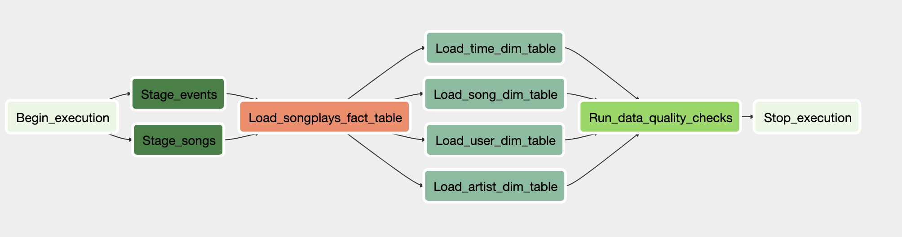

# Sparkify ETL

### Introduction

A music streaming company, Sparkify, has decided that it is time to introduce more automation and monitoring to their data warehouse ETL pipelines and come to the conclusion that the best tool to achieve this is Apache Airflow.

1. Getting Started  

- You'll need to run **Airflow**
- We provided the **docker-compose.yml** that you can use to start Airflow locally using Docker. Run the following command: `docker-compose up`
   
2. Pre-requisites
- You need to create a Redshift Cluster in AWS
- You'll need to execute all the DDL instructions on the **create_tables.sql** file.
- Creation of Variables on AirFlow 
  - `aws_region`
- Creation of Hooks
  - AWS
  - Postgres

3. Design of the DAG

4. Project Structure

- Folder **dags** contain the ETL DAG responsible for creating the tasks and defining the order of execution between them.
- Folder **plugins/operators** you will find all the custom operators to perform tasks such as staging the data, filling the data warehouse, and running checks on the data as the final step. 

5. Improvements

- Move the Data Quality query to a different helper module
- Rewrite the Data Quality operator a SubDAG